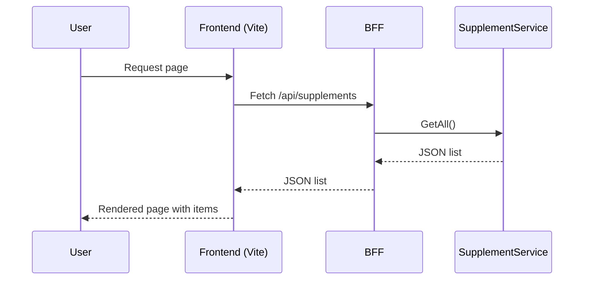

# Architect — Design Observations & Recommendations

- **Architecture summary:** Single BFF (C#) provides `/api/supplements`; frontend (Vite/React) proxies `/api` to the BFF in dev. CI builds both and publishes frontend to GitHub Pages.
- **Good choices:** BFF isolates backend logic; Vite for fast dev reloads; Playwright for robust E2E.
- **Concerns:**
  - Deployment target: GitHub Pages serves static assets only — if you expect server-hosted features for the BFF, choose a host (Azure App Service, container registry + cloud, or separate API host).
  - The `ci.yml` previously contained duplicate workflow blocks — consolidate to avoid confusion.
  - CORS policy currently allows all origins — acceptable for a scaffold but tighten before production.
- **Recommendations:**
  - Standardize on a modern .NET LTS (7 or 8) and update CI accordingly.
  - For E2E in CI, prefer `npm run build` + static server (e.g., `serve`) or use Playwright’s GitHub Action which supports start/serve semantics.
  - Add a small architecture diagram (Mermaid) to the README or docs for reviewers.

## Architecture Diagrams (Mermaid)

Below are two simple Mermaid diagrams to illustrate the high-level component layout and a typical request sequence.

Component diagram:

```mermaid
flowchart LR
  Browser[Browser]
  Frontend[Frontend\n(Vite + React)]
  BFF[BFF\n(.NET Minimal API / Startup)]
  Service[SupplementService]
  Data[(Optional Data Store)]

  Browser --> Frontend
  Frontend -->|/api/* proxy| BFF
  BFF --> Service
  Service --> Data
```

Sequence diagram (user load):



These diagrams are intentionally small and focus on the main flows for reviewers. Expand them with deployment, caching, auth, and CDN nodes as the architecture matures.
